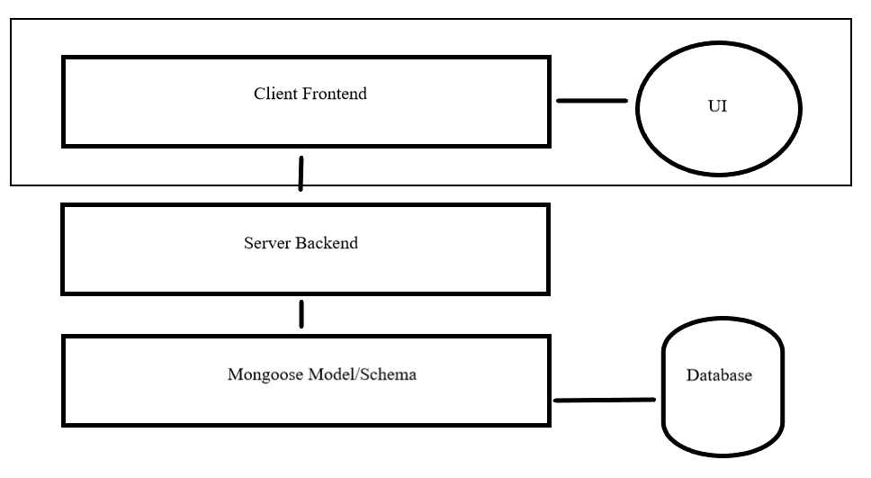
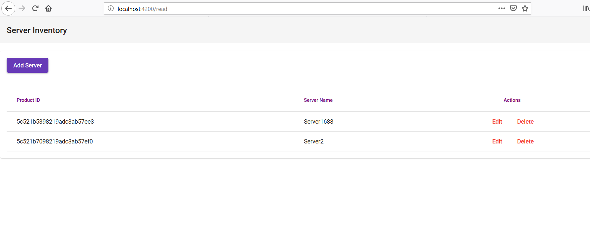
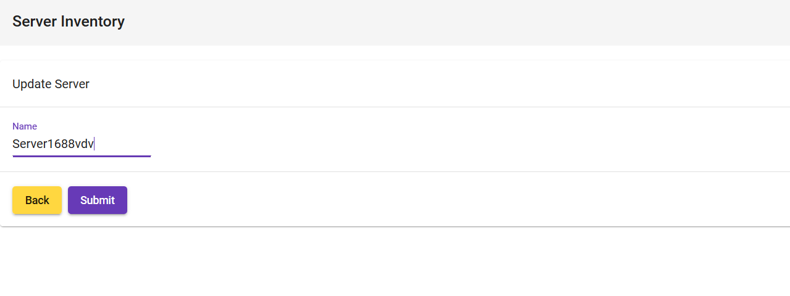
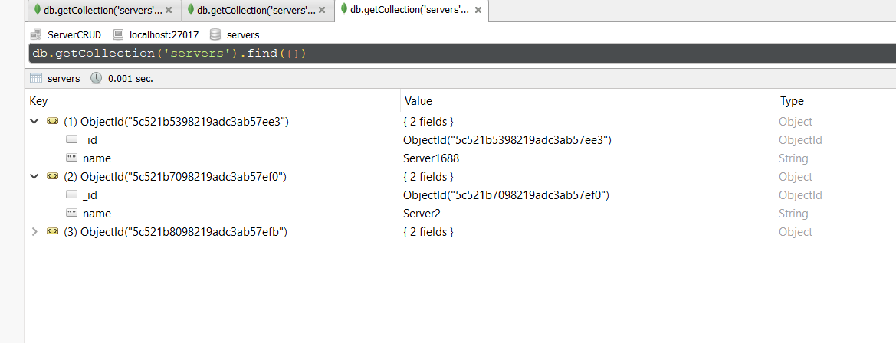

# InventoryCRUD

  Single-page web application built using Angular+Material. Backend and API built using Node and Express. Uses Mongoose (meant for MongoDB). Lists inventory read from NoSQL DB, allows users to create, update, and delete entries in the DB.
  
## How to Install

* Clone/Download repository
* Install dependencies for backend (Node) and start (App configured to listen on 60221)
  * Open new console
  * Navigate to /backendCRUD directory in console
  * 'npm install'
  * 'npm run dev'
* Install dependencies for frontend (Angular) and start (App configured to run on 60221)
  * Open new console
  * Navigate to /serverCRUD directory in console
  * 'ng update'
  * 'npm install'
  * 'ng serve --open'
* Setup MongoDB database (App configured to run on default 27017)
  * If you don't have MongoDB, install from MongoDB website
     * Make a folder on same drive as install with structure '[MONGODRIVE]://data/db'
  * Run Mongo server
  * Using Robo 3T or console+MongoClient, create new DB called 'servers' with collection 'servers'

## Description

  This repository contains a full-stack web application along with the backend required to use Mongoose+MongoDB for a NoSQL database. The database is not included (document-based). The system is divided into frontend, backend, database, and finally the user interface. Division is mostly due to Angular architecture.

  Using Angular's Material CSS library, the following UI was achieved. Users can perform basic CRUD operations on entries in the database by interacting with the frontend and UI, which sends requests to the backend. All fields taken by frontend are converted using Mongoose (Mainly, the ObjectID).

  Navigating the database was done using Robo3T, which provided a native GUI to interact with the MongoDB collections. The port selected (27017) was the default given by Robo3T when creating a new collection.

